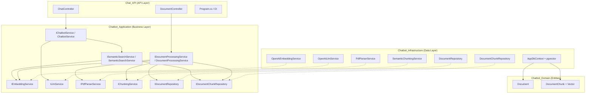

# 📋 Chatbot Closed-Domain — Implementation Plan (Cập nhật)

> **Mục tiêu**: Upload PDF → Parse → Chunk → Embedding → pgvector → Semantic Search → Chat API (hạn chế hallucination)

---

## 🏗️ Kiến trúc tổng quan (Đã hoàn thiện Phase 1, 2, 3)



> 🟢 **Trạng thái:** Toàn bộ code đã được dọn dẹp, implement đầy đủ và biên dịch (build) thành công 100%.

---

## 📊 Những phần đã hoàn thành

### 1. Dọn dẹp cấu trúc & Cấu hình (Phase 1)
- ✅ Xóa tất cả các file rỗng (stub files) và file mặc định (WeatherForecast).
- ✅ Bổ sung cấu hình vào `appsettings.json` (PostgreSQL Connection String & OpenAI API Key).
- ✅ Tạo các DTO (`ChatRequest`, `ChatResponse`, `UploadResponse`).
- ✅ Cấu hình Dependency Injection đầy đủ và thêm CORS Policy vào `Program.cs`.

### 2. Luồng xử lý PDF (Phase 2)
- ✅ **`PdfParserService`**: Sử dụng thư viện `UglyToad.PdfPig` để trích xuất text từng trang của PDF.
- ✅ **`SemanticChunkingService`**: Logic phân chia văn bản (chunking) thông minh dựa trên độ dài đoạn và quy tắc phát hiện Heading.
- ✅ **`DocumentProcessingService`**: Service trung tâm điều phối việc nạp file, gọi hàm Parse -> Chunk -> Gọi AI Embedding -> Lưu vào PostgreSQL.

### 3. Tích hợp Trí Tuệ Nhân Tạo (Phase 3)
- ✅ **`OpenAiEmbeddingService`**: Gọi API `text-embedding-3-small` để chuyển đổi văn bản sang Vector có kích thước 1536 chiều.
- ✅ **`OpenAiLlmService`**: Gọi API Chat Completions (`gpt-4o-mini`) của OpenAI với mức nhiệt độ (temperature) thấp là `0.3` để giảm tối đa hiện tượng "ảo giác" (hallucination).
- ✅ **`ChatbotService`**: Đã tinh chỉnh System Prompt Tiếng Việt với quy định nghiêm ngặt: yêu cầu AI chỉ được sử dụng dữ liệu trong RAG Rétrieval (Chunks), không tự bịa đặt.

---

## 🔴 CÁC VIỆC CẦN LÀM TIẾP THEO (Phase 4: Production-Ready)

| # | Task | Layer | Độ khó | Trạng thái |
|---|------|-------|--------|------------|
| 4.1 | **Áp dụng Database Migration**<br/>Chạy lệnh tạo bảng trên database thực tế (yêu cầu điền đúng Connection String vào `appsettings.json`) | Infra | ⭐⭐ | 🔴 Chờ thực thi |
| 4.2 | **Lịch sử hội thoại (ChatHistory)**<br/>Tạo Entity, Repository và Service để lưu lại các tin nhắn cũ của User + AI, truyền vào LLM thay vì chỉ truyền tin nhắn gần nhất. | All | ⭐⭐⭐ | 🔴 Chưa làm |
| 4.3 | **Background Processing cho PDF Upload**<br/>Xử lý PDF lớn mất nhiều thời gian nên cần dùng Hangfire hoặc BackgroundService (Worker) để tránh Timeout API. | API/Infra | ⭐⭐⭐ | 🔴 Chưa làm |
| 4.4 | **Error Handling & Validation Middleware**<br/>Xử lý bắt lỗi toàn cục, validation định dạng file. | API | ⭐ | 🔴 Chưa làm |

---

## ⚡ Hành động ngay lúc này

Bạn đã có thể bắt đầu sử dụng dự án. Tuy nhiên, trước khi chạy thử API, bạn hãy:
1. Mở file `Chat_API/appsettings.json` và thay `YOUR_PASSWORD_HERE` bằng password PostgreSQL của bạn.
2. Thay `YOUR_API_KEY_HERE` bằng OpenAI API Key thật.
3. Chạy câu lệnh tạo Database Migration.
```bash
dotnet ef migrations add InitialCreate --project Chatbot_Infrastructure --startup-project Chat_API
dotnet ef database update --project Chatbot_Infrastructure --startup-project Chat_API
```
