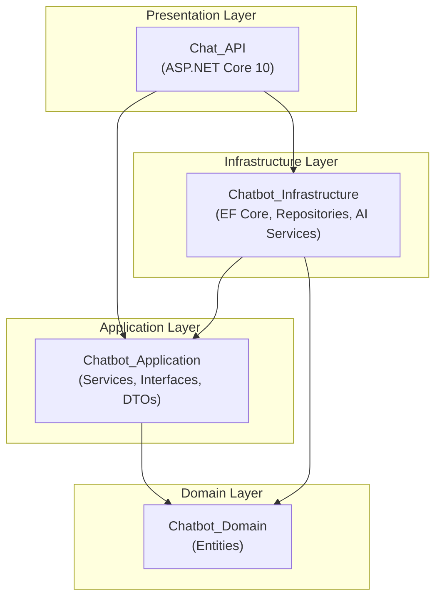
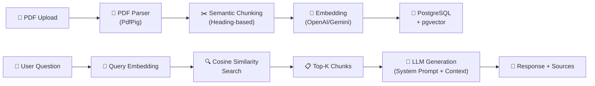
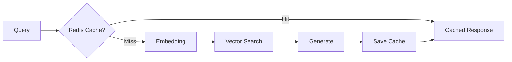
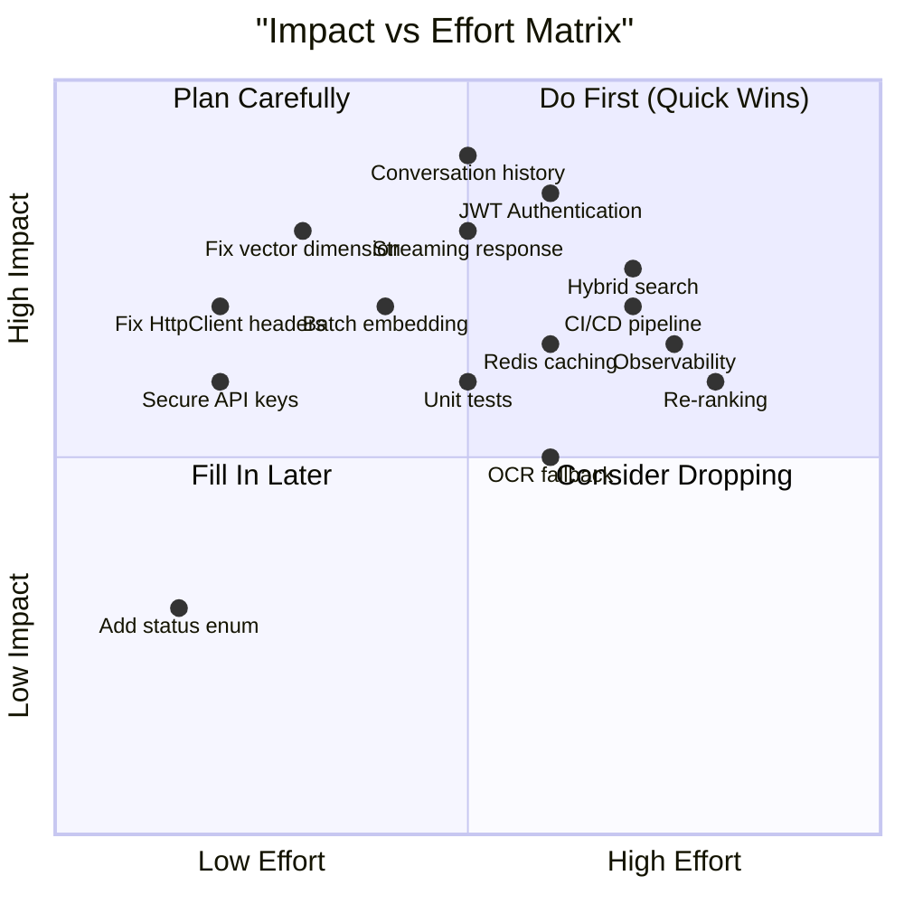

# 📋 Chat_API — Phân Tích Chức Năng & Kế Hoạch Cải Thiện

> **Ngày tạo:** 15/05/2026  
> **Phiên bản phân tích:** v1.0  
> **Tech Stack:** .NET 10 • PostgreSQL 17 + pgvector • OpenAI / Gemini API  

---

## 📑 Mục Lục

1. [Tổng Quan Kiến Trúc](#1-tổng-quan-kiến-trúc)
2. [Chức Năng Hiện Tại (Chi Tiết)](#2-chức-năng-hiện-tại-chi-tiết)
3. [Đánh Giá Điểm Mạnh / Điểm Yếu](#3-đánh-giá-điểm-mạnh--điểm-yếu)
4. [Kế Hoạch Cải Thiện (Roadmap)](#4-kế-hoạch-cải-thiện-roadmap)
5. [Ma Trận Ưu Tiên](#5-ma-trận-ưu-tiên)

---

## 1. Tổng Quan Kiến Trúc

### 1.1 Solution Structure — Clean Architecture



| Layer | Project | Vai trò |
|-------|---------|---------|
| **Presentation** | `Chat_API` | Controllers, Middleware, Background Workers, DI Setup |
| **Application** | `Chatbot_Application` | Business logic, Service interfaces, DTOs |
| **Domain** | `Chatbot_Domain` | Entities thuần (Document, DocumentChunk) |
| **Infrastructure** | `Chatbot_Infrastructure` | EF Core, Repositories, AI provider implementations |

### 1.2 RAG Pipeline Flow



---

## 2. Chức Năng Hiện Tại (Chi Tiết)

### 2.1 💬 Chat API — Hỏi đáp RAG

| Thông tin | Chi tiết |
|-----------|----------|
| **Endpoint** | `POST /api/chat/ask` |
| **Input** | `{ "message": "..." }` |
| **Output** | `{ "answer": "...", "sources": [...] }` |
| **File** | [ChatController.cs](file:///d:/Dự%20án%20SSI/Chat_API/Chat_API/Chat_API/Controllers/ChatController.cs) |

**Luồng xử lý:**
1. Nhận câu hỏi từ user → validate không rỗng
2. `SemanticSearchService` embed câu hỏi → tìm Top-K chunk tương tự (cosine distance)
3. Lọc theo `MinSimilarity` threshold (mặc định 0.6)
4. Nếu không tìm thấy context → trả fallback message
5. Build System Prompt chứa context → gửi LLM → trả response kèm sources

**Cấu hình RAG** (từ `appsettings.json`):
- `TopK`: 3 chunks
- `MinSimilarity`: 0.6
- `SystemHeader`: Prompt hệ thống tiếng Việt
- `NoContextFallback`: Thông báo khi không tìm thấy thông tin

---

### 2.2 📄 Document Management — Upload & Ingestion

| Thông tin | Chi tiết |
|-----------|----------|
| **Upload** | `POST /api/documents/upload` (multipart/form-data, max 50MB) |
| **Status** | `GET /api/documents/{id}/status` |
| **File** | [DocumentsController.cs](file:///d:/Dự%20án%20SSI/Chat_API/Chat_API/Chat_API/Controllers/DocumentsController.cs) |

**Luồng xử lý Upload:**
1. Validate file (not null, phải là `.pdf`)
2. Check trùng lặp theo `FileName` — nếu đã có + Completed + có chunks → bỏ qua
3. Lưu file vào thư mục `uploads/`
4. Tạo/cập nhật record `Document` với status `Queued`
5. Đẩy vào `DocumentIngestionQueue` (Channel-based)
6. Trả `202 Accepted` với status response

**Background Processing** ([DocumentIngestionWorker.cs](file:///d:/Dự%20án%20SSI/Chat_API/Chat_API/Chat_API/Background/DocumentIngestionWorker.cs)):
- `BackgroundService` chạy liên tục, dequeue từ `Channel<T>`
- Mỗi job: parse PDF → chunk → embed → save to DB
- Cập nhật status: `Queued → Processing → Completed/Failed`

---

### 2.3 📝 PDF Processing Pipeline

#### a) PDF Parser — [PdfParserService.cs](file:///d:/Dự%20án%20SSI/Chat_API/Chat_API/Chatbot_Infrastructure/Services/PdfParserService.cs)
- Sử dụng **PdfPig** (thư viện .NET) để extract text
- Chạy trong `Task.Run` (vì PdfPig là synchronous)
- Trả về `List<PageContent>` (mỗi page = text + page number)
- **Hạn chế:** Không hỗ trợ PDF scan (không có text layer)

#### b) Semantic Chunking — [SemanticChunkingService.cs](file:///d:/Dự%20án%20SSI/Chat_API/Chat_API/Chatbot_Infrastructure/Services/SemanticChunkingService.cs)
- Chia theo **heading** (regex pattern nhận diện heading tiếng Việt)
- Max chunk: 1000 ký tự, Min chunk: 100 ký tự
- Heading patterns: `"Chương", "Điều", "Mục", "Phần"`, số La Mã, dòng viết hoa >60%
- Chunk quá lớn → chia tiếp theo paragraph (`\n\n`)
- Chunk quá nhỏ → nối vào chunk trước

---

### 2.4 🤖 AI Provider System — Multi-Provider

| Provider | Embedding Model | Chat Model | Dimension |
|----------|----------------|------------|-----------|
| **OpenAI** | `text-embedding-3-small` | `gpt-4o-mini` | 1536 |
| **Gemini** | `text-embedding-004` | `gemini-2.0-flash` | 768 |

- Chuyển đổi qua config `AiSettings:Provider` (`OpenAI` hoặc `Gemini`)
- Temperature: `0.3` (low — giảm hallucination)
- Max tokens: `1024`
- Sử dụng `HttpClient` + raw JSON (không dùng SDK)

> [!WARNING]
> **Vector dimension hardcoded:** `AppDbContext` hardcode `vector(1536)` — chỉ đúng với OpenAI. Nếu chuyển sang Gemini (768 dims), cần migration lại DB.

---

### 2.5 🗄️ Database Layer

| Entity | Bảng | Mô tả |
|--------|------|-------|
| `Document` | `Documents` | Metadata file (FileName, FilePath, Status, UploadDate) |
| `DocumentChunk` | `DocumentChunks` | Content chunk + Embedding vector + Heading + PageNumber |

- **Database:** PostgreSQL 17 + extension `pgvector`
- **ORM:** Entity Framework Core 10
- **Vector Search:** Cosine Distance (`CosineDistance()` của pgvector)
- **Cascade Delete:** Xóa Document → tự động xóa tất cả Chunks

**DbSeeder** ([DbSeeder.cs](file:///d:/Dự%20án%20SSI/Chat_API/Chat_API/Chatbot_Infrastructure/Data/DbSeeder.cs)):
- Auto-migrate khi khởi động
- Đọc folder PDF từ `SeedSettings:PdfDirectoryPath`
- Skip file đã embed thành công (có chunks)
- Xóa record lỗi (0 chunks) và retry

---

### 2.6 🛡️ Cross-Cutting Concerns

| Feature | Implementation | File |
|---------|---------------|------|
| **Global Exception Handling** | Middleware catch all → trả JSON error + correlationId | [GlobalExceptionMiddleware.cs](file:///d:/Dự%20án%20SSI/Chat_API/Chat_API/Chat_API/Middleware/GlobalExceptionMiddleware.cs) |
| **Correlation ID** | Tự sinh/forward `X-Correlation-Id` header | [CorrelationIdMiddleware.cs](file:///d:/Dự%20án%20SSI/Chat_API/Chat_API/Chat_API/Middleware/CorrelationIdMiddleware.cs) |
| **Rate Limiting** | Fixed Window: 60 requests/phút, queue 10 | `Program.cs` |
| **CORS** | Configurable origins hoặc AllowAny | `Program.cs` |
| **Health Checks** | `/health/live` + `/health/ready` (DB check) | `Program.cs` |
| **HTTP Logging** | Request path + Response status code | `Program.cs` |
| **Model Validation** | Custom `InvalidModelStateResponseFactory` | `Program.cs` |

### 2.7 🐳 Deployment

- **Docker Compose:** 2 services (PostgreSQL + API)
- **Dockerfile:** Multi-stage build (.NET SDK → Runtime)
- **Environments:** Development / Staging / Production configs
- **Port:** 8080

---

## 3. Đánh Giá Điểm Mạnh / Điểm Yếu

### ✅ Điểm Mạnh

| # | Điểm mạnh | Ghi chú |
|---|-----------|---------|
| 1 | **Clean Architecture** rõ ràng | 4 layer tách biệt, DI đúng chuẩn |
| 2 | **Multi-provider AI** | Dễ switch OpenAI ↔ Gemini qua config |
| 3 | **Background processing** | Upload non-blocking nhờ Channel + BackgroundService |
| 4 | **Semantic chunking** thông minh | Heading detection phù hợp tài liệu tiếng Việt |
| 5 | **Production-ready basics** | Health checks, rate limiting, CORS, correlation ID |
| 6 | **Docker support** | Compose + Dockerfile sẵn sàng deploy |
| 7 | **Configurable RAG params** | TopK, MinSimilarity, SystemPrompt đều qua config |

### ❌ Điểm Yếu & Rủi Ro

| # | Vấn đề | Mức độ | Mô tả |
|---|--------|--------|-------|
| 1 | **Không có Authentication/Authorization** | 🔴 Critical | Bất kỳ ai cũng có thể gọi API, upload file, đọc data |
| 2 | **Không có Conversation History** | 🟡 High | Mỗi câu hỏi độc lập, không nhớ context hội thoại |
| 3 | **Vector dimension hardcoded** | 🟡 High | `vector(1536)` chỉ đúng OpenAI, switch Gemini sẽ crash |
| 4 | **Embedding gọi tuần tự** | 🟡 High | Mỗi chunk embed 1 lần → chậm khi file lớn (nên batch) |
| 5 | **Không có OCR fallback** | 🟡 High | PDF scan sẽ trả về 0 text, không có cảnh báo rõ |
| 6 | **Không có Streaming response** | 🟠 Medium | User phải đợi toàn bộ response, UX kém |
| 7 | **Không có caching** | 🟠 Medium | Mỗi query tương tự đều gọi embedding + DB + LLM lại |
| 8 | **Không có Unit Tests** | 🟠 Medium | Không có project test nào trong solution |
| 9 | **API Key trong appsettings** | 🟠 Medium | Nên dùng Secret Manager / Environment Variables |
| 10 | **DefaultRequestHeaders mutation** | 🟠 Medium | Set `Authorization` trên `DefaultRequestHeaders` → thread-unsafe khi concurrent |
| 11 | **Không có pagination** | 🟢 Low | Endpoint list documents không có |
| 12 | **Không có delete document API** | 🟢 Low | Repository có `DeleteAsync` nhưng controller không expose |
| 13 | **Status dùng magic string** | 🟢 Low | `"Queued"`, `"Processing"`, `"Completed"` → nên dùng enum |

---

## 4. Kế Hoạch Cải Thiện (Roadmap)

### Phase 1: 🔴 Critical Fixes (1-2 tuần)

#### 1.1 Fix Vector Dimension Compatibility
```diff
// AppDbContext.cs
- entity.Property(e => e.Embedding).HasColumnType("vector(1536)");
+ var dim = configuration.GetValue<int>("AiSettings:EmbeddingDimension", 1536);
+ entity.Property(e => e.Embedding).HasColumnType($"vector({dim})");
```
- Đọc dimension từ config thay vì hardcode
- Tạo migration mới khi chuyển provider

#### 1.2 Fix Thread-Unsafe HttpClient Headers
```diff
// Trong tất cả AI services:
- _httpClient.DefaultRequestHeaders.Authorization = new AuthenticationHeaderValue("Bearer", _apiKey);
+ var request = new HttpRequestMessage(HttpMethod.Post, url);
+ request.Headers.Authorization = new AuthenticationHeaderValue("Bearer", _apiKey);
+ request.Content = content;
+ var response = await _httpClient.SendAsync(request);
```

#### 1.3 Secure API Key Storage
- Loại bỏ API key khỏi `appsettings.json`
- Sử dụng `dotnet user-secrets` cho development
- Sử dụng Environment Variables cho production (đã có trong compose.yml)

---

### Phase 2: 🟡 Core RAG Improvements (2-4 tuần)

#### 2.1 Conversation History (Chat Memory)

**Thêm Entity mới:**
```csharp
public class Conversation
{
    public Guid Id { get; set; }
    public string? UserId { get; set; }
    public DateTime CreatedAt { get; set; }
    public ICollection<ChatMessage> Messages { get; set; }
}

public class ChatMessage
{
    public Guid Id { get; set; }
    public Guid ConversationId { get; set; }
    public string Role { get; set; } // "user" | "assistant"
    public string Content { get; set; }
    public DateTime Timestamp { get; set; }
}
```

**Cập nhật API:**
```
POST /api/chat/ask
{
    "conversationId": "guid-or-null",  // null = tạo mới
    "message": "..."
}
```
- Gửi N tin nhắn gần nhất vào LLM context
- Giới hạn token window (ví dụ: 10 messages hoặc 4000 tokens)

#### 2.2 Batch Embedding
```csharp
// Thay vì embed từng chunk:
var embeddings = await _embeddingService.GenerateBatchEmbeddingAsync(
    chunkResults.Select(c => c.Content).ToList()
);
```
- OpenAI hỗ trợ batch embedding (gửi array input)
- Giảm đáng kể số lần API call và latency

#### 2.3 OCR Fallback cho PDF Scan
- Detect PDF không có text layer (PdfPig trả về 0 pages)
- Fallback sang Gemini Vision API hoặc Tesseract OCR
- Log warning cho admin

#### 2.4 Hybrid Search (Vector + Keyword)
```sql
-- Kết hợp cosine similarity + full-text search
SELECT *, 
    (0.7 * (1 - embedding <=> query_vec)) + 
    (0.3 * ts_rank(to_tsvector('simple', content), plainto_tsquery('simple', :query))) 
    AS hybrid_score
FROM document_chunks
ORDER BY hybrid_score DESC
LIMIT :topK;
```
- Thêm GIN index cho full-text search
- Cải thiện recall cho các truy vấn keyword-heavy

---

### Phase 3: 🔐 Security & Auth (2-3 tuần)

#### 3.1 Authentication — JWT Bearer
```csharp
builder.Services.AddAuthentication(JwtBearerDefaults.AuthenticationScheme)
    .AddJwtBearer(options => {
        options.TokenValidationParameters = new TokenValidationParameters {
            ValidateIssuer = true,
            ValidateAudience = true,
            ValidateLifetime = true,
            ValidateIssuerSigningKey = true,
            // ...
        };
    });
```

#### 3.2 Authorization — Role-based
| Role | Quyền |
|------|-------|
| `User` | Chat, xem document status |
| `Admin` | Upload, delete, manage documents |

#### 3.3 File Upload Security
- Scan virus (ClamAV integration)
- Giới hạn file size per user/day
- Validate PDF header (magic bytes `%PDF-`)

---

### Phase 4: 🚀 Scalability & Performance (3-4 tuần)

#### 4.1 Streaming Response (SSE)
```csharp
[HttpPost("ask/stream")]
public async IAsyncEnumerable<string> AskStream([FromBody] ChatRequest request)
{
    await foreach (var token in _chatbotService.GetStreamingResponseAsync(request.Message))
    {
        yield return token;
    }
}
```
- Sử dụng Server-Sent Events (SSE)
- UX cải thiện đáng kể (response hiện từng từ)

#### 4.2 Caching Layer

- Cache embedding results cho các query lặp lại
- Cache LLM response theo query hash + context hash
- TTL: 1 giờ (configurable)

#### 4.3 Database Indexes
```sql
-- IVFFLAT index cho vector search nhanh hơn
CREATE INDEX idx_chunks_embedding ON document_chunks 
    USING ivfflat (embedding vector_cosine_ops) WITH (lists = 100);

-- Index cho status lookup
CREATE INDEX idx_documents_status ON documents (status);
CREATE INDEX idx_documents_filename ON documents (file_name);
```

#### 4.4 Document Queue — Upgrade to Durable Queue
- Hiện tại: In-memory `Channel<T>` → mất data khi app restart
- Nên dùng: **RabbitMQ**, **Redis Streams**, hoặc **Hangfire** với persistent storage

---

### Phase 5: 🧠 Advanced AI Features (4-6 tuần)

#### 5.1 Re-ranking
- Sau vector search, dùng Cross-Encoder re-rank Top-K → Top-N
- Cải thiện precision đáng kể

#### 5.2 Query Decomposition
- Câu hỏi phức tạp → tách thành sub-queries
- Mỗi sub-query search riêng → merge results

#### 5.3 Summarization Chain
- Nếu context quá dài → summarize trước khi gửi LLM
- Map-Reduce pattern: summarize từng chunk → merge summaries

#### 5.4 Multi-modal Support
- Hỗ trợ upload hình ảnh, bảng biểu trong PDF
- Sử dụng Vision API để extract thông tin từ hình

#### 5.5 Feedback Loop
```csharp
public class ChatFeedback
{
    public Guid Id { get; set; }
    public Guid MessageId { get; set; }
    public bool IsHelpful { get; set; }   // 👍 / 👎
    public string? Comment { get; set; }
}
```
- Thu thập feedback từ user
- Dùng để fine-tune prompt, adjust MinSimilarity threshold

---

### Phase 6: 🏭 Production Readiness (2-3 tuần)

#### 6.1 Testing
| Loại | Framework | Phạm vi |
|------|-----------|---------|
| Unit Tests | xUnit + Moq | Services, Chunking logic |
| Integration Tests | `WebApplicationFactory` | API endpoints, DB queries |
| Load Tests | k6 / Artillery | Throughput, latency under load |

#### 6.2 Observability
- **Structured Logging:** Serilog → Seq/ELK
- **Metrics:** Prometheus + Grafana (response time, token usage, cache hit rate)
- **Distributed Tracing:** OpenTelemetry

#### 6.3 CI/CD Pipeline
```yaml
# .github/workflows/ci.yml
- Build & Test
- Docker Build & Push
- Deploy to Staging → Smoke Tests → Deploy to Production
```

#### 6.4 API Documentation
- Thêm Swagger/OpenAPI với mô tả chi tiết
- Versioning: `/api/v1/chat/ask`

---

## 5. Ma Trận Ưu Tiên



### Tóm Tắt Ưu Tiên Theo Thứ Tự

| Thứ tự | Task | Impact | Effort | Lý do |
|--------|------|--------|--------|-------|
| 🥇 | Fix HttpClient thread-safety | High | Low | Bug ẩn, gây crash khi concurrent |
| 🥇 | Fix vector dimension config | High | Low | Blocking khi đổi AI provider |
| 🥇 | Secure API keys | High | Low | Security risk |
| 🥈 | Conversation History | Very High | Medium | Core UX, user cần nhất |
| 🥈 | Batch Embedding | High | Medium | Giảm 80%+ thời gian ingest |
| 🥈 | Streaming Response | High | Medium | UX tốt hơn nhiều |
| 🥉 | JWT Authentication | Critical | Medium-High | Bắt buộc cho production |
| 🥉 | Unit Tests | High | Medium | Đảm bảo quality khi refactor |
| 4 | Redis Caching | Medium-High | Medium | Giảm chi phí API + tăng tốc |
| 5 | Hybrid Search | High | High | Cải thiện accuracy RAG |
| 6 | CI/CD + Observability | High | High | Cần cho production ops |

---

> [!IMPORTANT]
> **Gợi ý bắt đầu:** Nên ưu tiên Phase 1 (Critical Fixes) trước vì effort thấp nhưng giải quyết bug và security risk. Sau đó chuyển sang Conversation History (Phase 2.1) vì đây là feature có impact lớn nhất đến trải nghiệm người dùng.
